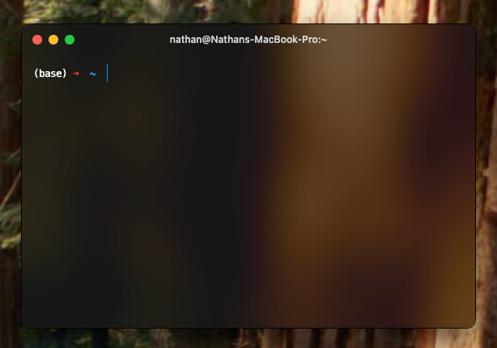

# (Work in progress)

 

    <a href="https://github.com/vercel/hyper?tab=readme-ov-file">
        <picture>
            
        </picture>
    </a>
    <h1>HyperClean</h1>
    
A Clean and Feature-Rich Hyper Setup for <b>MacOS</b> 

    <picture>
        <source media="(prefers-color-scheme: light)" srcset="README-src/sc/scLight.png">
        
    </picture>
     
    <picture>
        <source media="(prefers-color-scheme: light)" srcset="https://raw.githubusercontent.com/NathanDagDane/HyperClean-MacOS/refs/heads/main/README-src/svg/also-available-light.svg">
        
    </picture>

---

<!-- TOC -->

  
Table of Contents

  <ol>
    <li><a href="#final-product">Final Product</a>
      <ul>
        <li><a href="#looks">Looks</a></li>
        <li><a href="#features">Features</a></li>
        <li><a href="#overview">Overview</a></li>
      </ul>
    </li>
    <li><a href="#installing-hyper">Installing Hyper</a></li>
    <li><a href="#configuring-settings">Configuring Settings</a></li>
    <li><a href="#installing-plugins">Installing Plugins</a>
      <ul>
        <li><a href="#simple-plugins">Simple Plugins</a></li>
        <li><a href="#npm-plugins">NPM Plugins</a></li>
      </ul>
    </li>
    <li><a href="#oh-my-zsh">Oh My ZSH!</a>
      <ul>
        <li><a href="#installation">Installation</a></li>
        <li><a href="#configuration">Configuration</a></li>
        <li><a href="#set-up-autocomplete">Set Up Autocomplete</a></li>
      </ul>
    </li>
  </ol>

<!-- TOC -->

---

# Final Product
### Looks

### Features

### Overview
- MacOS (Windows soon/link)
- Will be acessing 2 files:
    - **`.hyper.js` is for configuring Hyper looks and features**.  
      It can be found in `~/.hyper.js` or by presing **⌘+,** inside Hyper.
    - **`.zshrc` is for configuring your ZSH settings and plugins.**  
      It can be found in `~/.zshrc`. It is a system file, meaning it affects all terminals across the systrem, so be careful.  
  > #### Can't find the files?  
  > `~/...` means inside your `user` directory.  
  > This can be found at the absolute address: `Mackintosh HD/Users/*your-name*`, or by opening your `Downloads` folder in Finder, holding **⌥**, and clicking the folder after `Users` at the bottom of the window.
  >
  > These files are hidden, so press **⌘⇧.** to see these files.

# Installing Hyper

# Configuring Settings

# Installing Plugins
### Simple Plugins

### NPM Plugins

# Oh My ZSH!
### Installation

### Configuration

### Set Up Autocomplete
